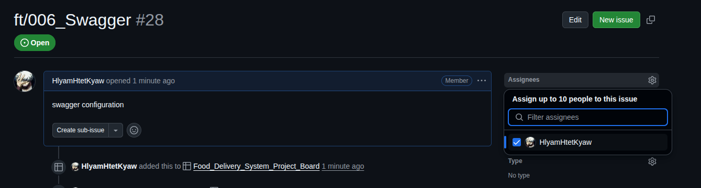
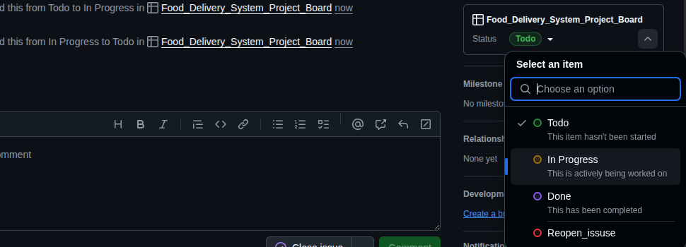

# 🍽️ Food Ordering System Java ☕️

A backend service for managing food order processing — including order placement, tracking, delivery assignment, and overall workflow automation.

---


## 📚 Content

1. [Development Guide 001 - Project Structure](#-development-guide-001---project-structure)
2. [Development Guide 002 - Git & GitHub Flow](#-development-guide-002---git--github-flow)

---


## 📘 Development Guide 001 - Project Structure

### ✅ Overview

This project is organized using a **hybrid structure** combining **technical partitioning** and **domain-driven partitioning**, adhering to a **layered architectural style**. Each folder has a clear responsibility, either grouped by technical concern (e.g., configuration, security) or by business/domain logic (e.g., features, entities).

---

## 📂 Folder Structure Explanation

| Folder | Description | Partition Type | Layer |
| --- | --- | --- | --- |
| `common/` | Contains common utilities like enums, converters, and constants. | Technical Partition | Shared Utility Layer |
| `entity/` | Houses core domain master entity, typically reused across entities. | Domain Partition | Domain Layer |
| `jpa/` | Custom JPA configuration such as naming strategies. | Technical Partition | Infrastructure Layer |
| `storage/` | Implements storage-specific services (e.g., file storage). | Technical Partition | Infrastructure Layer |
| `config/` | Spring and general configuration beans (e.g., `ModelMapper`). | Technical Partition | Configuration Layer |
| `exceptions/` | Custom exception classes and exception handling utilities. | Technical Partition | Shared/Service Layer |
| `response/` | Standardized response DTOs and utilities (e.g., API response wrappers). | Technical Partition | Presentation Layer |
| `features/` | Contains business-specific logic grouped by feature/domain (e.g., User, Restaurant, etc.). | Domain Partition | Application/Domain Layer |
| `model/` | JPA entities used within the database mapping. | Domain Partition | Persistence Layer |
| `security/` | Security configuration (e.g., JWT, filters). | Technical Partition | Infrastructure Layer |
| `startup/` | Initialization logic (e.g., seed roles or default users using `CommandLineRunner`). | Technical Partition | Bootstrap/Init Layer |

---

## 📊 Partitioning Strategy

### 🔷 Technical Partition

Groups code by **technical responsibility**.

### 🔶 Domain Partition

Groups code by **business domains or features**.

---

## 🏗️ Layered Architecture Mapping

The architecture generally follows this layer stack:

```
Presentation Layer
  └── response/
  └── controller classes inside features/

Application Layer
  └── services inside features/
  └── startup/ (business initialization logic)

Domain Layer
  └── entity/
  └── model/
  └── common/ (enums, value objects, etc.)

Persistence/Infrastructure Layer
  └── jpa/
  └── storage/
  └── config/
  └── security/

Shared/Utility Layer
  └── exceptions/
  └── common/
```

Each `feature/` sub-folder may itself follow mini-layered separation:

- `controller/` (Presentation)
- `service/` (Application)
- `repository/` (Persistence)
- `dto/` (Transport)

---

## 🔧 Development Best Practices

1. **Add new domain logic inside `features/`** grouped by feature.
2. **Reuse common enums or converters from `common/`.**
3. **Use DTOs in `features/` for exposure.**
4. **All configuration should live in `config/`, including beans.**
5. **Initialization logic (e.g., seeding roles) belongs in `startup/`.**
6. **Security-related logic (JWT filters, WebSecurityConfigurerAdapter, etc.) belongs in `security/`.**
7. **Use `exceptions/` for centralized error handling and throw meaningful custom exceptions.**

---

📁 **API Base Path**

The API base path is defined in `application.properties`:

```
api.base.path = /api/v1
```

## 📦 Example of Creating a New Feature

If you’re adding a new feature called `Order`, you might create:

```
features/order/
├── controller/
│   └── OrderController.java          <-- Handles HTTP/API requests
│
├── service/
│   ├── OrderService.java             <-- Service interface (business logic)
│   └── impl/
│       └── OrderServiceImpl.java     <-- Concrete implementation of service
│
├── repository/
│   └── OrderRepository.java          <-- JPA Repository interface
│
├── dto/
│   ├── request/
│   │   └── OrderRequestDto.java      <-- Incoming request data structure
│   └── response/
│       └── OrderResponseDto.java     <-- Outgoing response data structure
```

Also consider:

- Adding startup logic in `startup/` if you need to seed orders.

## 1. `OrderController.java`

```java
@ResttController
@RequestMapping("${api.base.path}/orders")
@RequiredArgsConstructor
public class OrderController {

    private final OrderService orderService;

    @PostMapping
    public ResponseEntity<ApiResponse> createOrder(
            @RequestBody final OrderRequestDto orderRequest,
            final HttpServletRequest request) {

        ApiResponse response = orderService.createOrder(orderRequest);
        return ResponseUtils.buildResponse(request, response);
    }
}
```

## 2. `OrderService.java` (interface)

```java
public interface OrderService {
    ApiResponse createOrder(OrderRequestDto requestDto);
}

```

## 3. `OrderServiceImpl.java`

```java
@Service
@RequiredArgsConstructor
@Transactional
public class OrderServiceImpl implements OrderService {

    private final OrderRepository orderRepository;
    private final ProductRepository productRepository;
    private final ModelMapper modelMapper;

    @Override
    public ApiResponse createOrder(OrderRequestDto requestDto) {

        Product product = productRepository.findById(requestDto.getProductId())
                .orElseThrow(() -> new EntityNotFoundException("Product not found."));

        Order order = new Order();
        order.setProduct(product);
        order.setQuantity(requestDto.getQuantity());
        order.setCustomerEmail(requestDto.getCustomerEmail());

        orderRepository.save(order);

        OrderResponseDto responseDto = modelMapper.map(order, OrderResponseDto.class);

        return ApiResponse.builder()
                .success(1)
                .code(HttpStatus.CREATED.value())
                .message("Order created successfully.")
                .data(Map.of("order", responseDto))
                .build();
    }
}

```

## 4. `OrderRequestDto.java`

```java
@Data
public class OrderRequestDto {
    private Long productId;
    private Integer quantity;
    private String customerEmail;
}
```

## 5. `OrderResponseDto.java`

```java
@Data
public class OrderResponseDto {
    private Long id;
    private String productName;
    private Integer quantity;
    private String customerEmail;
    private LocalDateTime createdAt;

```

## 6.  `OrderRepository.java`

```java
@Repository
public interface OrderRepository extends JpaRepository<Order, Long> {

}
```

> Note: When creating a new repository, please name the interface based on the feature you're implementing.
>
>
> For example, if your feature is to retrieve a list of orders, name the repository interface as `GetOrderListRepository`.
>

---


# 📘 Development Guide 002 - Git & GitHub flow

## 🧭 Git & GitHub Workflow Guide

This guide outlines how our team collaborates using Git and GitHub. Follow these steps to ensure consistency, traceability, and smooth integration of your work.

---

### 📌 1. Assigning Your Ticket

- Go to the GitHub project board.
- Choose a ticket you'd like to work on (ideally one ticket is handled by **two developers** for collaboration).
- If you're confident handling it solo, feel free to assign yourself alone.
- Assign yourself to the ticket.

  <p>
  
  </p>


---

### **🚦 2. Update Ticket Status**

- To start working on your ticket, select **"In Progress"** from the status dropdown..

  <p>
  
  </p>


---

### 🌱 3. Branching Strategy

Our branching strategy follows a simplified **Git Flow** model:

- Branch name should match the **ticket name**.
- Branches are created from the `dev` branch.

### 🛠 To start working on your ticket:

```bash
git fetch origin
git checkout <your-ticket-name>     # e.g. ft/000_test
git pull origin dev
```

> ✅ If there are no conflicts, you’re ready to start coding!
>

---

### ✅ 4. Committing & Pushing Your Work

Once you've completed your assigned task:

```bash
git checkout <your-ticket-branch>      # Switch to your working branch

git stash                              # Save your local changes

git pull origin dev                    # Pull latest updates from dev

git stash pop                          # Reapply your stashed changes

# 👉 Solve any conflicts if they appear

git add .                              # Stage the resolved files

git commit -m "your commit message"    # Commit your changes

git push origin <your-ticket-branch>   # Push to your remote branch
```

---

### 🔁 5. Creating a Pull Request (PR)

1. Go to GitHub and create a **Pull Request (PR)** from your branch **into `dev`**.
    - **Right side:** your ticket branch
    - **Left side:** `dev` branch
2. Assign yourself in the **Assignees** section.
3. Choose one of the following as a **Reviewer**:
    - `YeZawHlaing`
    - `minzayarmaung`
    - `HlyamHtetKyaw`

---

### 🚨 6. Finalizing

- If there are any issues, you will be asked to fix them before merging.
- Once approved, your branch will be merged into `dev`, and the ticket will be marked as complete.

---

### 📎 Notes

- Use clear, descriptive commit messages.
- Keep your branch updated regularly with the `dev` branch.
- Collaborate with your co-assignee for peer reviews and troubleshooting.

---

## **📘 Development Guide 001**

[Folder Structure](https://www.notion.so/Development-Guide-001-2287c768d231809d9cefd3c977be4e4a?pvs=21)
 